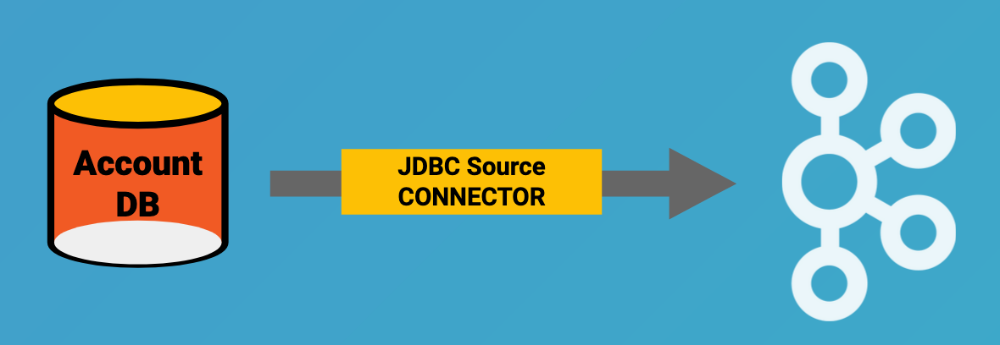
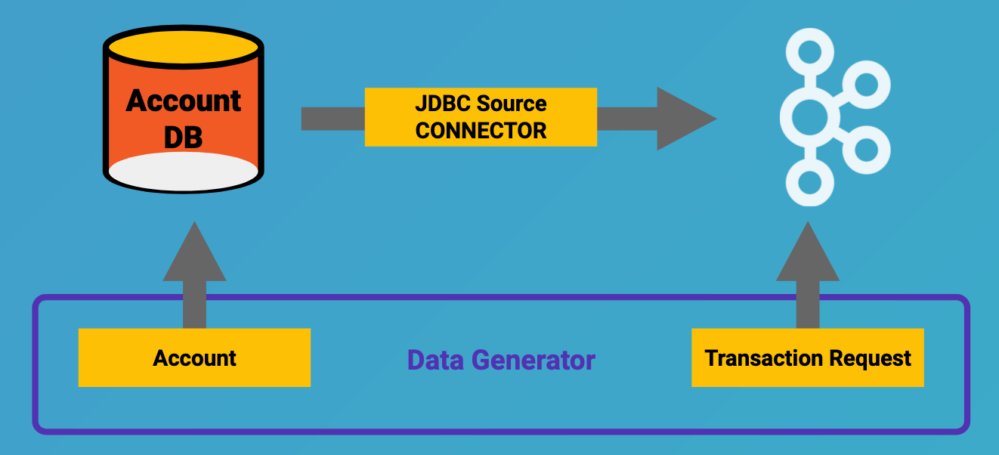

# [Main](../../README.md) / Loading referential data with Kafka Connect

To leverage the full power of stream processing, it is a good practice to pre-load the required data in topics. Kafka Streams and ksqlDB will allow you to join and lookup data from your events with any other topic. 

In this section of the workshop, we will set up a Kafka Connect JDBC Source connector instance that will synchronize any data from a PostgreSQL instance to an `account` topic in Kafka. 

This exercise simulates a Change Data Capture pattern where we bridge an existing data source to Kafka in realtime.



## Creating a connector instance

Run the following command from the root of the workshop project folder:

```
docker-compose/local/connectors/deploy-jdbc-connector.sh
```

## Start the Data Generator application

Within the workshop project, you will find a `data-generator` folder containing an application designed to generate some random accounts in our PostgreSQL `Account DB`. This utility application will generate around 1000 test accounts. The Data Generator also contains a REST Endpoint to help us submit transaction requests to Kafka later on during the workshop.

The data generator can be launched by running the following command from the root of the workshop project folder:



To run the Data Generator application, you can use your Java IDE to launch the main method from `src/main/java/dev/daniellavoie/demo/kstream/data/DataGeneratorApplication.java`.

You can also start the application from CLI by building it and running it:

To build: 

```
./mvnw -f data-generator/pom.xml clean package
```

To run after build:

```
java -jar data-generator/target/data-generator.jar
```

After the data set is completely generated, you should observe an output mentionning that 1000 accounts were created:

```
2020-02-09 13:22:22.857  INFO 68184 --- [unt-Generator-1] d.d.d.k.d.d.account.AccountServiceImpl   : Generated account number 1000.
```

## Monitor the account data flowing in Kafka from Control Center

Access Control Center from http://localhost:9021.

From the main screen, access the topic view with the following links: `Cluster 1 / Topics`.

Click on the `account` topic and access the `messages` tab. Click on the `offset` textbox and type `0` and press enter to instruct C3 to load all messages from partition 0 starting from offset 0.

With the connector running, you should observe `account` events in the UI.


## Next step

In the [next section](../streams/streams.md), we will implement a highly scalable stream processing application using Kafka Stream.