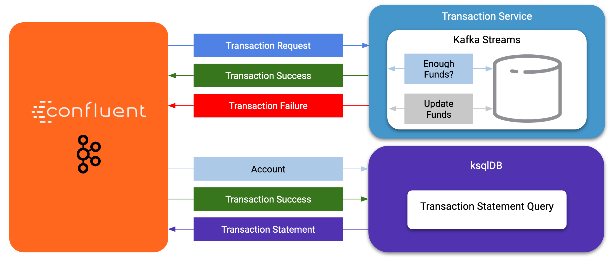
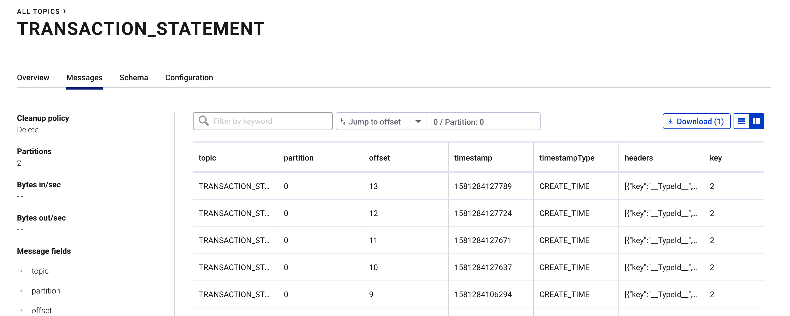

# [Main](../../README.md) / Enrich transaction results with ksqlDB

If you recall, in the [first section](../connector/connector-linux.md) of this workshop, we configured a JDBC Source Connector to load all account details into an `account` topic.

In this next exercise, we will write a second Stream Processor to generate a detailed transaction statement enriched with account details. 

Rather than within this new service as another Kafka Streams application, we will leverage ksqlDB to declare a stream processor who will enrich our transaction data in real-time with our referential data coming from the `account` topic. The objective of this section is to showcase how a SQL-like query language be used to generate streams processors just like Kafka Streams without having to compile and run any custom piece of software.



## Connect to ksqlDB with CLI

With ksqlDB `0.6.0`, an official CLI is shipped as a Docker image. The docker-compose stack of the workshop includes a container that we can access to run some KSQL queries.

```
docker exec -it  kstreams-demo-ksqldb-cli ksql http://ksqldb:8088
```

## Create the account table

ksqlDB is built on top of Kafka Streams. As such, the `KStream` and `KTable` are both key constructs for defining stream processors.

The first step requires us to instruct ksqlDB that we wish to turn the `account` topic into a `Table`. This table will allow us to join each `transaction-success` event with the latest `account` event of the underlying topic. Run the following command in your ksqlDB CLI terminal:

``` 
CREATE TABLE ACCOUNT (
  number INT,
  cityAddress STRING,
  countryAddress STRING,
  creationDate BIGINT,
  firstName STRING,
  lastName STRING,
  numberAddress STRING,
  streetAddress STRING,
  updateDate BIGINT
) WITH (
  KAFKA_TOPIC = 'account',
  VALUE_FORMAT='JSON'
);
```

## Create the transaction-success stream

Before we create the `Transaction Statement` stream processor, we also need to inform ksqlDB that we wish to turn the `transaction-success` into a `Stream`. Run the following command in your ksqlDB CLI terminal:

```
CREATE STREAM TRANSACTION_SUCCESS (
  transaction STRUCT<
    guid STRING, 
    account STRING, 
    amount DOUBLE, 
    type STRING, 
    currency STRING,
    country STRING
  >,
  funds STRUCT<
  account STRING,
  balance DOUBLE
  >,
  success boolean,
  errorType STRING
) WITH (
  kafka_topic='transaction-success', 
  value_format='json'
);
```

## Create the transaction statement stream

Now that we have all the ingredients of our `Transaction Statement` stream processor, we can now create a new stream derived from our `transaction-success` events paired with the latest data from the `account` topic. We will instruct ksqlDB to create a new stream as a Query. By default, ksqlDB will publish any output to a new `TRANSACTION_STATEMENT` topic. The select query provides the details about with events to subscribe as well as which table to join each notification. The output of this new stream processor will be a mix of the transaction details coupled with all the details of the matching account. The key from `transaction-success` and `account` will be used as matching criteria for the `LEFT JOIN` command. `EMIT CHANGES` informs ksqlDB that this query is long-running and should continuously be kept alive. Just as if it was a Kafka Streams application to be 100% available to process all events. Run the following command in your ksqlDB CLI terminal:

```
CREATE STREAM TRANSACTION_STATEMENT AS
  SELECT *  
  FROM TRANSACTION_SUCCESS
  LEFT JOIN ACCOUNT ON TRANSACTION_SUCCESS.rowkey = ACCOUNT.rowkey
  EMIT CHANGES;
```

## Monitor the Transaction Statements in Control Center

Access Control Center from http://localhost:9021.

From the main screen, access the topic view with the following links: `Cluster 1 / Topics`.

Click on the `TRANSACTION_STATEMENT` topic and access the `messages` tab. Click on the `offset` textbox and type `0` and press enter to instruct C3 to load all messages from partition 0 starting from offset 0.

