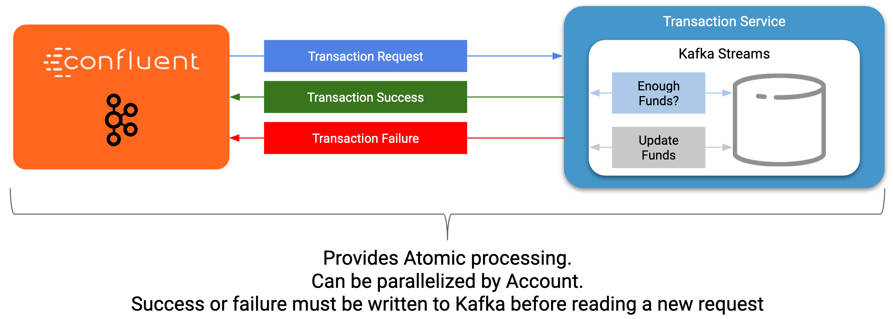
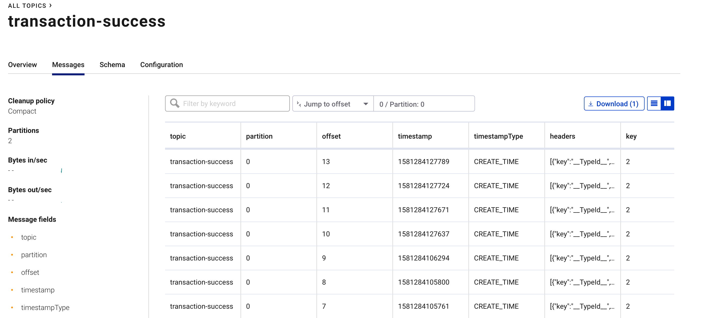
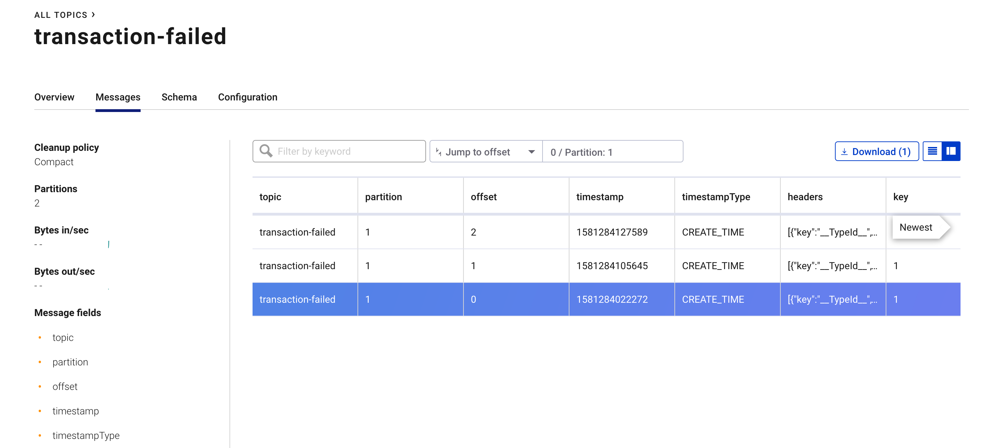

# [Main](../../README.md) / Implementing a Stream Processor with Kafka Streams

Now is the time to get into the heart of the action. We will implement a Kafka Streams topology to process atomic transactions to any request submitted to the `transaction-request` topic. 

Within the workshop project folder, you will find a `kstreams-demo` subfolder that represents a Kafka Streams application. All of the boilerplate code required to connect to Kafka is already taken care of (thank you, Spring Boot). This workshop will focus on writing a Kafka Streams topology with the function processing for our use case.

## "Help me! I can't figure out what code to modify!"

If during the exercise you are lost, you can at any point reset your codebase and switch to the `solution` to run the Stream Processor without coding the solution yourself.

Be careful before running the next command as you will lose any uncommitted changes in your local git repository:

```
git reset --hard origin/master && git checkout solution
```

## Atomic transaction processing with Kafka Streams

Our business requirement states that for every request we receive, we check if the funds are sufficient before updating the balance of the account being processed. We should never have two transactions being processed at the same time for the same account. This would create a race condition for which we have no guarantee that we can enforce the balance check before withdrawing funds.

The Data Generator writes transaction requests to the Kafka topic with a key equals to the account number of the transaction. As such, we have the guarantee that all messages of an account will be proccessed by a single thread for our Transaction Service no matter how many instances of it are concurrently running.

Kafka Streams will not commit any message offset until it completes our business logic of managing 



## Implement the Transaction Transformer

Because of the transaction nature of our stream processor, we require a specific component from Kafka Streams named a `Transformer`. This utility allows us to process events one by one while interacting with a `State Store`, another component of Kafka Streams that allows us to persist our account balance.

Open the `dev.daniellavoie.demo.kstream.TransactionTransformer` Java class and implement the `transform` function to return a `TransactionResult` based on the validity of the transaction request. The `TransactionResult` contains a `success` flag that should be set to `true` if the funds were successfully updated.

The `transform` method also has the responsibility of updating the `store` State Store. The class already contains utility functions to help you execute our business logic.

If you are stuck on this exercise, you can switch to the `solution-transformer` branch:

```
git reset --hard origin/master && git checkout solution-transformer
```

## Implement the Streaming Topology

In Kafka Streams, a `Topology` is the definition of your data flow. It's a manifest for all operations and transformations to be applied to your data. 

To start a stream processor, Kafka Streams only requires us to build a `Topology` and to hand it over. Kafka Streams will take care of managing the underlying consumers and producers.

The `dev.daniellavoie.demo.kstream.KStreamConfig` Java class already contains all the boilerplate code required by Kafka Streams to start our processor. In this exercise, we will leverage a `StreamsBuilder` to define and instantiate a `Topology` that will handle our transaction processing.

Open the `dev.daniellavoie.demo.kstream.KStreamConfig.defineStreams` method and get ready to write your first Kafka Streams Topology.

### Create a KStream from the source topic.

Use the `stream` method of `streamsBuilder` to turn a topic into a `KStream`.

```
KStream<String, Transaction> transactionStream = streamsBuilder

  .stream("transaction-request");
```

### Leverage the Transformer to process our requests

To inform Kafka Streams that we want to update the `funds` State Store for all incoming requests atomically, we can leverage the `transformValues` operator to plugin our `TransactionTransformer`. This operator requires us to specify the name of the `funds` State Store that will be used by the `Transformer`. This also Kafka Streams to keep track that events from our `transaction-request` will result in a change of state for that store.

```
KStream<String, TransactionResult> resultStream = transactionStream

  .transformValues(
    this::transactionTransformer, 
    "funds"
  );
```

### Redirect the transaction result to the appropriate topic.

With a new derived stream containing `TransactionResult`, we can now use the information contained in the payload to feed a success or failure topic.

We will achieve by deriving two streams from our `resultStream`. Each will be built by applying a `filter` and `filterNot` operator with a predicate on the `success` flag from our `TransactionResult` payload. With the two derived streams, we can explicitly call the `to` operator to instruct Kafka Streams to write the mutated events to their respective topics.

```
resultStream

  .filter(this::success)

  .to("transaction-successs");

resultStream

  .filterNot(this::success)

  .to("transaction-failed");
```

### The implemented defineStreams method

Use this reference implementation to validate that you have the right stream definition.

```
private void defineStreams(StreamsBuilder streamsBuilder) {
  KStream<String, Transaction> transactionStream = streamsBuilder
  
    .stream("transaction-request");
    

  KStream<String, TransactionResult> resultStream = transactionStream

    .transformValues(
      this::transactionTransformer, 
      "funds"
    );

  resultStream

    .filter(this::success)

    .to("transaction-successs");

  resultStream

    .filterNot(this::success)

    .to("transaction-failed");
  }
```

## Running the Kafka Streams application

If you are running the application from your Java IDE. Just launch the main method from `dev.daniellavoie.demo.kstream.KStreamDemoApplication`.

If you want to run with the CLI, you will need to build the application before launching it.

To build:

```
./mvnw -f kstreams-demo/pom.xml clean package
```

To run:

```
java -jar kstreams-demo/target/kstreams-demo.jar
```

## Generate some transactions using the Data Generator endpoint

Ensure that you Data Generator application is still running from [the previous section](../connector/connector-linux.md#start-the-data-generator-application).

The utility script `scripts/generate-transaction.sh` will let you generate transactions. Generate a couple of transaction with the following commands:

```
scripts/generate-transaction.sh 1 DEPOSIT 100 CAD
scripts/generate-transaction.sh 1 DEPOSIT 200 CAD
scripts/generate-transaction.sh 1 DEPOSIT 300 CAD
scripts/generate-transaction.sh 1 WITHDRAW 300 CAD
scripts/generate-transaction.sh 1 WITHDRAW 10000 CAD

scripts/generate-transaction.sh 2 DEPOSIT 100 CAD
scripts/generate-transaction.sh 2 DEPOSIT 50 CAD
scripts/generate-transaction.sh 2 DEPOSIT 300 CAD
scripts/generate-transaction.sh 2 WITHDRAW 300 CAD
```

The script takes in argument the account number, the amount, the type of operation (`DEPOSIT` or `WITHDRAW`) and the currency.

## Monitor the successful transaction results from Control Center

Access Control Center from http://localhost:9021.

From the main screen, access the topic view with the following links: `Cluster 1 / Topics`.

Click on the `transaction-success` topic and access the `messages` tab. Click on the `offset` textbox and type `0` and press enter to instruct C3 to load all messages from partition 0 starting from offset 0.

With the connector running, you should observe `account` events in the UI.



## Monitor the failed transaction results from Control Center

Click on the `topic` tab from the cluster navigation menu. Select the `transaction-failed` topic and access the `messages` tab. Click on the `offset` textbox and type `0` and press enter to instruct C3 to load all messages from partition 0 starting from offset 0.

With the connector running, you should observe `account` events in the UI. If you can't see any message, try your lock with partition 1 starting from offset 0.



## Next step

In the [next section](../ksqldb/ksqldb.md), we will explore how writing Stream Processor can even be more simplified with `ksqlDB`.